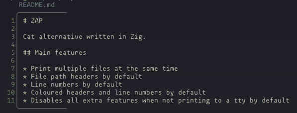

# ZAP

*Cat alternative written in Zig.*

## Main Features

* Print multiple files at the same time
* File path headers by default
* Line numbers by default
* Coloured headers and line numbers by default
* Disables all extra features when not printing to a tty by default

